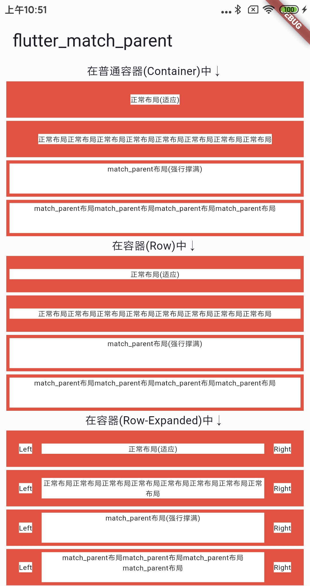

[](https://pub.dev/packages/flutter_match_parent)

# flutter_match_parent

Flutter 实现 Android 中的 match_parent 效果.



## Installation

安装最新版本 [](https://pub.dev/packages/flutter_match_parent/install)

## Quick Start

导入对应的包, 使用 `matchParent` 扩展方法包裹需要实现 `matchParent` 效果的组件即可.

```dart
Widget(...).matchParent();
```

支持的属性:

```dart
/// 对齐方式
AlignmentDirectional alignment;

/// 是否撑满宽度
bool matchWidth;

/// 是否撑满高度
bool matchHeight;
```

## license

MIT License

Copyright (c) 2023 angcyo